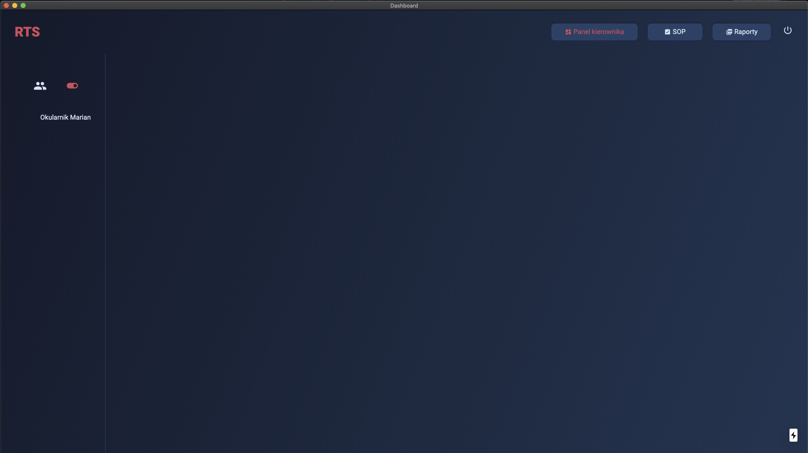
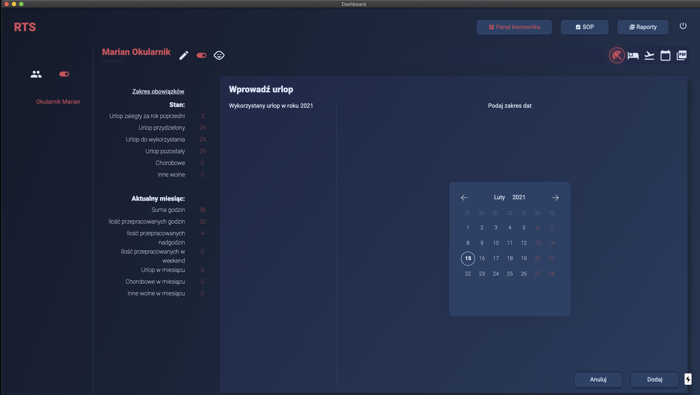
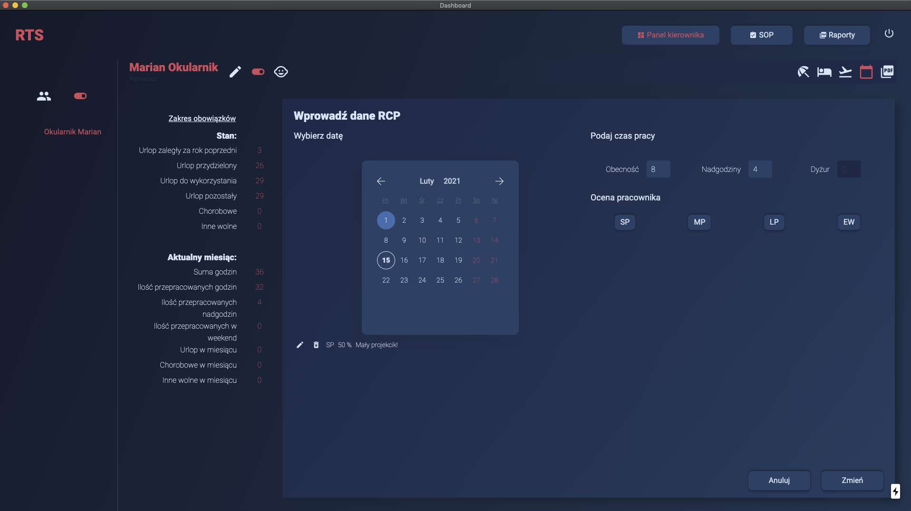
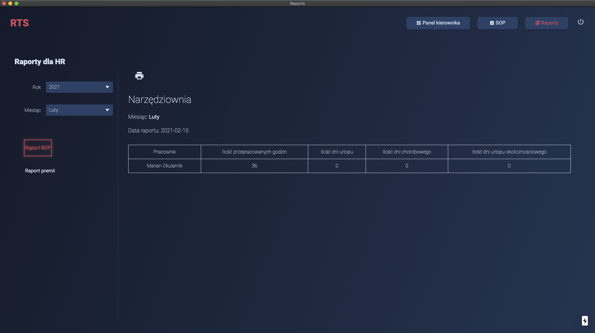
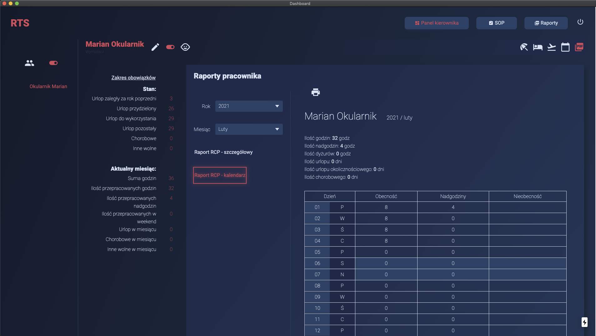

# TRS - time registration system

It is a project to help some small companies keep employees' work timetable as well as evaluate employees and generate monthly reports.
The application does not require any external database or internet connection as it runs with a local file-based nedb database. With this structure admin can keep the application on an external drive and use it anywhere he needs.

## Application 🚀









## What is it

The project is an electron desktop application with a fixed window size built for the Windows environment. The app lets the admin login into the main dashboard. In the dashboard, the admin can add new employees, edit employees, change employment status, mark if the employee is a juvenile worker, add working time, overtime, and weekend hours. The admin can also see and edit project evaluation options as well as add employee evaluation. Apart from that, he can add holidays, sick days, and other leave time. There is an option to add a sheet of responsibilities for particular employees. The app will generate a monthly bonus for employees based on employee overtime and evaluation.

The app is my first attempt with next.js and react so there is a place for improvements.

### Run it

When build just run the Time Registration System.exe file and you are ready to go.

## Installation

  ```bash
# Clone the Project
$ git clone https://github.com/rogreyroom/rts-app.git

# Install dependencies
$ yarn # or npm install

# Run your app
$ yarn dev # or npm run dev

# Format project
$ yarn format # or npm run format

# Lint
$ yarn lint:fix # or npm run lint:fix

# Package Your App
$ yarn build:win # or npm run build:win
```

## Build with

- nextron (<https://github.com/saltyshiomix/nextron>)
- nedb async (<https://github.com/Akumzy/nedb-async>)
- joi (<https://>)
- axios (<https://github.com/axios/axios>)
- react hook form (<https://react-hook-form.com>)
- react modern calendar datepicker (<https://>)
- react confirm alert (<https://>)
- date fns (<https://>)
- react-to-print (<https://>)
- styled components (<https://styled-components.com>)

## Version

v.0.1.1

## Author

Robert Adamczewski

## License

This project is licensed under MIT License - see the [LICENSE](./LICENSE) file for details.
